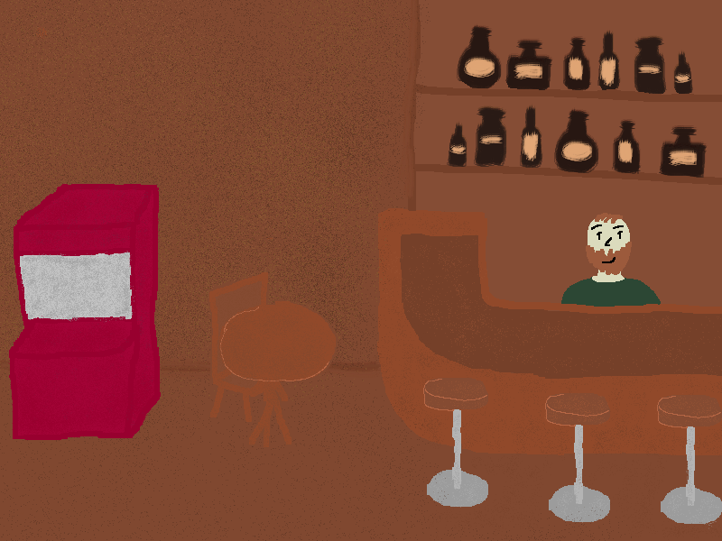
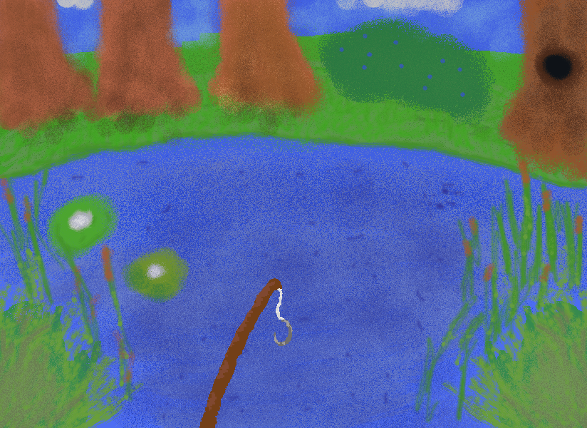

GAME TUTORIAL:

English:

CONTROLS:
- Movement: A / D
- Interaction: E
- Open inventory: Click the bucket icon
- Saving the game: Sleep (bed in the cabin)

🎣 FISHING:
- Go to the shore and board the boat (E)
- Go to the right corner of the boat and press (E)
- Choose bait from the bucket
- Press the spacebar to cast
- Wait for a fish to bite
- Type the letters on your keyboard that are displayed on the screen

BUCKET (INVENTORY):
- You can see squares in the bucket indicating the number of slots for catches
- Use the gray button to exit the bucket
- You can attach bait to the rod using the green button or remove it using the red button. After selecting bait, you can happily exit the bucket using the gray button and start fishing.
- You can see the number of baits purchased above their icon (e.g., 0x)
- The UPGRADES section shows you the following statistics:
"maximum inventory slot:" - the number of unlocked squares
"fewer presses:" - how many fewer letters on the screen you need to press while fishing
"shorter waiting time:" - how much the waiting time to hook a catch is reduced
"max baits amount:" - the maximum number of baits you can have

🏪 SHOP:
The shop has two sections — SELL (sell your catches) and BUY (purchase upgrades and bait).
Upgrades:

SELL (sell your catches):
Each fish has a different value — rarer fish = more coins.
You can use coins to buy upgrades and bait in the BUY section, or for food and drinks.

BUY:
Bucket - expands your inventory by 6 slots for each purchase
Fewer taps - while fishing, 1 fewer letter appears for each purchase
Shorter Wait - reduces the wait time to catch a fish by 0.2 seconds for each purchase
Bait Bowl - increases the total number of baits the player can carry

📊 STATISTICS (HUNGER / THIRST / MISERY):
Click the icon at the bottom of the screen to view your statistics. Keep an eye on them—they affect your fishing.

Hunger
Decreases gradually as you play. You can replenish it at the food stand near the garage.
Side effect: the hungrier you are, the longer you have to wait for a fish to bite.

Thirst
Gradually decreases as you play. You can replenish it at the bar—with water, juice, cola, or beer.
Side effect: the thirstier you are, the slower you move around the map.

Misery
Increases automatically as hunger and thirst decrease. Decreases by resting by the fireplace in the house.
Side effect: the higher your misery, the more keys you have to press while fishing.

Tip: Keep all three stats high—it will make fishing much easier

Czech:

OVLÁDÁNÍ:
- Pohyb: A / D
- Interakce: E
- Otevření inventáře: Klikněte na ikonu kbelíku
- ukládaní hry: spánek (postel v chatce)

🎣 RYBAŘENÍ:
- Jděte k pobřeží a nastupte do lodě (E)
- Dojděte na pravý roh lodě a stiskněte (E)
- Zvolte si návnadu v kyblíku
- Stiskněte mezerník pro nahození
- Počkejte, až se ryba nachytí na prut
- Klikejte písmena na klávesnici které jsou zobrazená na obrazovce

KYBLÍK (INVENTÁŘ):
- V kbelíku jsou vidět čtverečky, které naznačují počet míst pro úlovky
- pomocí šedivého tlačítka kyblík opustíte
- Můžete nasadit návnadu na prut pomocí zeleného tlačítka či ji sundat pomocí červeného tlačítka. Po zvolení návnady můžete vesele opustit kyblík pomocí šedého tlačítka a začít lovit.
- Počet zakoupených návnad vidíte nad jejich ikonou (např.: 0x)
- Část UPGRADES vám ukazuje dané statistiky:
"maximum inventory slot:" - počet odemčených čverečků
"fewer presses:" - o kolik méně písmen na obrazovce musíte zmáčknout při rybaření
"shorter waiting time:" - o kolik se vám zkracuje čas čekání na nachycení úlovku na prut
"max baits amount:" - součet návnad kterých můžete mít maximálně

🏪 SHOP (OBCHOD):
V shopu máš dvě sekce — SELL (prodej úlovků) a BUY (nákup vylepšení a návnad).
Upgrady:

SELL(prodej úlovků):
Každá ryba má jinou hodnotu — vzácnější ryby = více coinů.
Coins využijete na nákup upgradů a návnad v sekci BUY, nebo na jídlo a pití.

BUY(nákup):
Kyblík - rozšiřuje inventář o 6 míst za každý nákup
Méně zmáčknutí - při rybaření se zobrazí o 1 písmeno méně za každý nákup
Kratší čekání - zkracuje čekací dobu na nachycení ryby o 0.2 sekundy za každý nákup
Miska s návnady - zvětšuje počet součtu všech návnad které hráč může mít u sebe

📊 STATISTIKY (HUNGER / THIRST / MISERY):
Statistiky zobrazíte kliknutím na ikonu v dolní části obrazovky. Sledujte je — mají vliv na rybaření

Hunger (Hlad)
Postupně klesá během hraní. Doplníte ho v stánku s jídlem u garáže.
Vedlejší efekt: čím více máte hlad, tím déle čekáte na nachycení ryby na prut.

Thirst (Žízeň)
Postupně klesá během hraní. Doplníte ji v baru — vodou, džusem, colou nebo pivem.
Vedlejší efekt: čím více máte žízeň, tím pomaleji se pohybujete po mapě.

Misery (Deprese)
Roste automaticky jak klesá hlad a žízeň. Snižuje se odpočinkem u krbu v domě.
Vedlejší efekt: čím vyšší misery, tím více písmen musíte zmáčknout při rybaření.

Tip: Udržujte všechny tři statistiky vysoké — výrazně vám to usnadní rybaření
